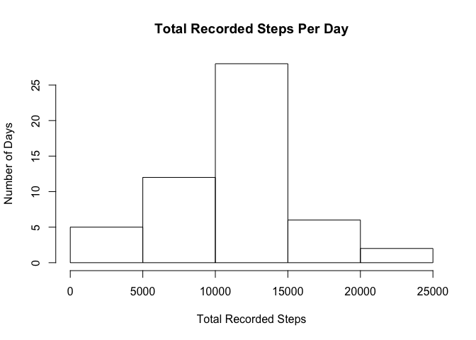
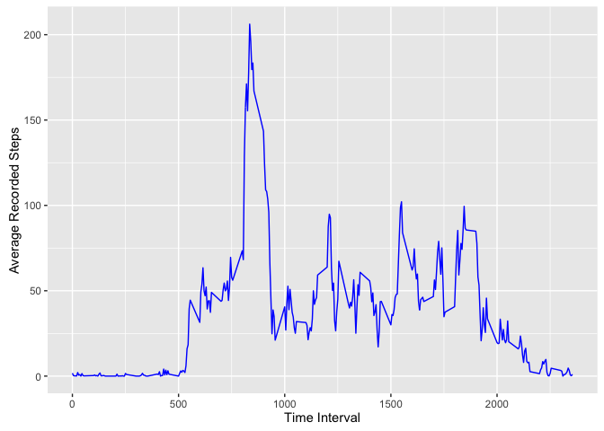
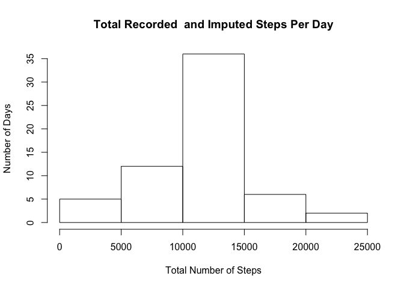
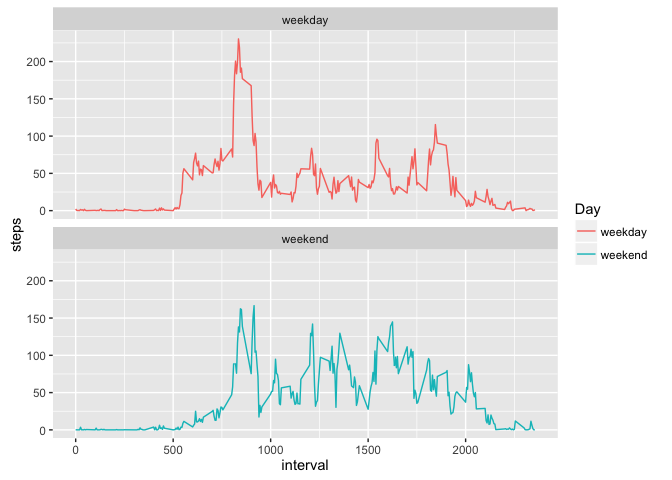

# Reproducible Research: Peer Assessment 1
## Introduction / Data Source
The following analyses utilize data collected by a personal activity monitoring device and includes two months of observations (October and November 2012) of three variables - steps taken, an identifier for 5-minute intervals, and the date each observation was made. The data set is stored in a csv file totaling 17,568 observations.

The data were accessed by first cloning the github repository located at https://github.com/rdpeng/RepData_PeerAssessment1.git. The repository was cloned and the activity data set was obtained on March 10, 2016. The data set can also be accessed at: https://d396qusza40orc.cloudfront.net/repdata%2Fdata%2Factivity.zip

## Loading and preprocessing the data
###Loading the Data:

As the repository was cloned directly from the master, the associated data file (activity.zip) is located in the user's working directory and can be accessed by opening R Studio and running the following code: 

```r
unzip("activity.zip")

ActiveData <-read.csv("activity.csv")
```
###Examining and Preprocessing the Data:

After loading the data, the structure of the data file was examined to detect any preprocessing that would be necessary to conduct further analyses:

```r
str(ActiveData)
```

```
## 'data.frame':	17568 obs. of  3 variables:
##  $ steps   : int  NA NA NA NA NA NA NA NA NA NA ...
##  $ date    : Factor w/ 61 levels "2012-10-01","2012-10-02",..: 1 1 1 1 1 1 1 1 1 1 ...
##  $ interval: int  0 5 10 15 20 25 30 35 40 45 ...
```


The results indicate that the date variable is classified as a factor variable, which could cause problems with further analyses, so the variable was coerced into a date classification.

```r
ActiveData$date <- as.Date(ActiveData$date)
```

Upon viewing the structure of the data set, it was noted that there appeared to be a number of missing values in the "steps" variable. Using the sum() function, the number of missing values can be calculated.

```r
sum(is.na(ActiveData$steps))
```

```
## [1] 2304
```

So, there are 2,304 missing values in the "steps" variable.

## What is mean total number of steps taken per day?
*For this portion of the analysis, missing values will be ignored, so a separate data set was created which excludes all missing values in the "steps" variable. 

```r
ActiveData_X <- ActiveData[which(!is.na(ActiveData$steps)),]
```

Create a histogram of the total number of steps taken per day.

In order to calculate the total number of steps taken per day, a new variable called "StepsPerDay" was created.

```r
StepsPerDay <- tapply(ActiveData_X$steps, ActiveData_X$date, sum, na.rm = TRUE)
```

Next, a histogram was generated to view the total number of steps recorded each day.

```r
library(ggplot2)
```

```
## Warning: package 'ggplot2' was built under R version 3.2.3
```

```r
qplot(StepsPerDay, xlab = "Total Number of Steps", ylab = "Number of Days", main = "Total Recorded Steps Per Day", binwidth = 500)
```

\


Next, the mean and median number of recorded steps per day were calculated.

```r
MeanSteps <- mean(StepsPerDay)
MedianSteps <- median(StepsPerDay)
```

```r
MeanSteps
```

```
## [1] 10766.19
```


```r
MedianSteps
```

```
## [1] 10765
```


So, the mean steps recorded per day is 10766.19, and the median of the steps recorded per day is 10765.

## What is the average daily activity pattern?
*In order to examine activity throughout the day, the ActiveData_X data set (which excludes missing values) will be used to conduct the following analyses. 

A time-series plot of the 5-minute interval and number of steps taken averaged across all days was created to examine the relationship between interval and number of steps recorded. It should be noted that the interval variable is expressed as a one to four digit measure which corresponds roughly to military time, wherein 0 = 00:00, or midnight, 500 = 05:00, or 5:00am, 1000 = 10:00am, 1500 = 15:00, or 3:00pm and 2000 = 20:00, or 8:00pm. 

```r
library(dplyr)
```

```
## 
## Attaching package: 'dplyr'
```

```
## The following objects are masked from 'package:stats':
## 
##     filter, lag
```

```
## The following objects are masked from 'package:base':
## 
##     intersect, setdiff, setequal, union
```

```r
DailyActivity <- ActiveData_X %>%
        group_by(interval) %>%
        summarize(steps = mean(steps))


library(ggplot2)
ggplot(data = DailyActivity, aes(x=interval, y=steps, group=1)) +
        geom_line(color = "blue") +
        xlab("Time Interval") +
        ylab("Average Recorded Steps")
```

\

In order to determine which time interval, across all days, has the maximum recorded average steps, the which.max() function was applied to the DailyActivity data. 

```r
DailyActivity[which.max(DailyActivity$steps), ]
```

```
## Source: local data frame [1 x 2]
## 
##   interval    steps
##      (int)    (dbl)
## 1      835 206.1698
```


As the resulting matrix demonstrates, the interval with the maximum average steps across all days is 835, which corresponds to 8:35am, with a mean of 206 steps. 

## Imputing missing values
As previously demonstrated, there are a number of missing values in the data set, which could potentially introduce bias in the analyses. In order to ameliorate bias issues, missing values were imputed using the average (mean) number of steps across all days for each interval. 

First, the total number of missing values was again calculated.

```r
sum(is.na(ActiveData$steps))
```

```
## [1] 2304
```

The results indicate that the original data set includes 2,304 missing values (coded as 'na').

Next, a strategy for imputing missing values was devised. The strategy entailed filling in missing values with the mean number of steps recorded for each time interval across all days in the data set. 

A new data set was then created in which the missing values were replaced with the imputed values.

```r
ActiveData_Imp <- ActiveData
NAs <- is.na(ActiveData_Imp$steps)
MeanInterval <- tapply(ActiveData_Imp$steps, ActiveData_Imp$interval, mean, na.rm = TRUE, simplify = TRUE)
ActiveData_Imp$steps[NAs] <- MeanInterval[as.character(ActiveData_Imp$interval[NAs])] 
```

In order to determine that all missing values have been replaced with the imputed data values, the sum function was called, as follows:

```r
sum(is.na(ActiveData_Imp$steps))
```

```
## [1] 0
```


The results indicate that there are no remaining missing values in the data set. 

To determine the impact of using the imputed data set as opposed to the original data set with missing values removed, the total steps per day variable was recalculated with the imputed data and another histogram was generated.

```r
StepsPerDay_Imp <- tapply(ActiveData_Imp$steps, ActiveData_Imp$date, sum)
qplot(StepsPerDay_Imp, xlab = "Total Number of Steps", ylab = "Number of Days", main = "Total Recorded  and Imputed Steps Per Day", binwidth = 500)
```

\

The histogram appears to demonstrate an increase in the number of days that steps totaling 10,000 to 15,000 were recorded. In order to ensure that this is not bias introduced by the imputation strategy, the mean and median number of recorded and imputed steps per day were again calculated.

```r
MeanSteps_Imp <- mean(StepsPerDay_Imp)
MedianSteps_Imp <- median(StepsPerDay_Imp)
```

```r
MeanSteps_Imp
```

```
## [1] 10766.19
```


```r
MedianSteps_Imp
```

```
## [1] 10766.19
```


As the results indicate (and can be anticipated), the means of the original and imputed data sets are equal, while the medians demonstrate a slight difference, with the original data set possessing a median of 10765 and the imputed data set possessing a median of 10766.19 (an increase of 1.19 steps). 

## Are there differences in activity patterns between weekdays and weekends?
Finally, the question of whether activity patterns demonstrate clear differences on weekends as opposed to weekdays was explored by first adding a factor variable "Day" to the imputed data set to denote the differences between days of the week each observation was made. 

```r
library(dplyr)
ActiveData_Imp <- mutate(ActiveData_Imp, Day = ifelse(weekdays(ActiveData_Imp$date) == "Saturday" | weekdays(ActiveData_Imp$date) == "Sunday", "weekend", "weekday"))
```

Next, the average steps per interval were again calculated for the imputed data set and a panel plot was created to compare the time-series data of average steps per interval (across all days) by weekdays and weekends. 

```r
library(dplyr)
DailyActivity_Imp <- ActiveData_Imp %>%
        group_by(interval, Day) %>%
        summarize(steps = mean(steps))
library(ggplot2)
TS <- ggplot(DailyActivity_Imp, aes(x = interval, y = steps, color = Day)) +
        geom_line() +
        facet_wrap(~Day, ncol = 1, nrow = 2)
print(TS)
```

\

As the panel plot demonstrates, there is indeed a difference in activity patterns on weekends as opposed to weekdays, with weekdays showing a sharper increase at an earlier time and peaking sharply at approximately 8:35am and weekends demonstrating a later 'start' time and a more consistent activity level throughout the day.  
